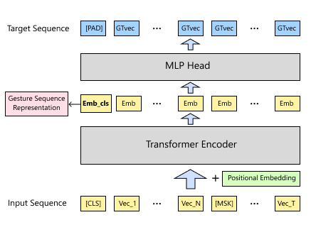
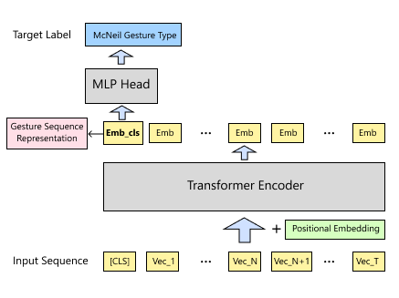

# GestureBERT: Automatic Gesture Individuation


## 💡 About

This is the **official codebase** for the paper **“Automatic gesture individuation with GestureBERT.”**

GestureBERT is a transformer-based model that learns fixed-length embedding vectors for co-speech gestures by drawing an analogy to word embeddings in natural language. We present an automated computer vision pipeline that extracts from video data 454-dimensional per-frame kinematic gesture features, which consist of 3D joint trajectories, palm orientations, palm locations, and hand-shape descriptor vectors, as specified in the MIT Speech Communication Group gesture coding manual. These vectors are aggregated into 32-frame gesture sequences, which are then used to pre-train GestureBERT with the task of predicting masked gesture frames, followed by fine-tuning for human-annotated gesture function classification. Evaluation shows that the pipeline reliably encodes kinematic information and learns an effective clustering of gestures based on shared movement patterns. Furthermore, the distribution of clustered gesture "tokens" approximately follows the Zipf's law, a phenomenon that is analogous to that observed in natural language. 

<p align="left">
  
  &nbsp;&nbsp;&nbsp;&nbsp;
  
</p>
<p align="left">
  
</p>


---

## 📦 Environment Setup

All dependencies are specified in `conda_requirements.yml`.

**Create & activate the environment:**
```bash
conda env create -f conda_requirements.yml -n GestureBERT
conda activate GestureBERT
```


---

## 🧰 Dataset & Pipeline Summary

Our experiments are based on the **Multisimo Dataset** curated at **Trinity College Dublin** (https://multisimo.eu/datasets.html). The executable workflow has three parts:

1) CV Feature Extraction: Extract **per-frame gesture kinematic features** with an integrated pipeline using **OpenPose**, **SMPL-X**, **YOLO**, and **ViT**.  
2) Model Training: Train GestureBERT to obtain **temporally fused gesture embeddings** via pre-training and fine-tuning tasks.  
3) Evaluation & Analysis: Evaluate **masked-frame predictability**, apply **K-means clustering** to final gesture representation embeddings (drawn in TSNE groups), tast against **Zipf's law** and analyze what type of gesture motions are clustered in the same cluster groups.

---

## ⬇️ Downloads

1) **Gesture-motion video clips** (clipped from raw Multisimo)  *~5.6 GB*  
   https://drive.google.com/file/d/16-dyeO4I-UBQjtiFkQ59ND74CFVF55E0/view?usp=sharing

2) **Processed per-frame gesture kinematic features** for the above videos  *~300 MB*  
   https://drive.google.com/file/d/1ktpC9eLu42bbOOcNj_KbF0yP614vxA-Q/view?usp=sharing

3) **Trained models & required 3rd-party compter-vision models**  *~1.5 GB*  
   https://drive.google.com/file/d/1stEX0ftmFGURQVUAgBjxelVzF5Aliqcq/view?usp=sharing

---

## 🚀 Quick Reproduction

### Option 1: Use our processed features
1. Download the processed features:
   https://drive.google.com/file/d/1ktpC9eLu42bbOOcNj_KbF0yP614vxA-Q/view?usp=sharing  
   Place the extracted contents under:
   ```
   data/multisimo
   ```

2. Pre-train (masked-frame prediction):
```bash
python GestureBERT_core/BERT_trainer.py
```

3. Fine-tune (gesture function classification):
```bash
python GestureBERT_core/train_GesGroup.py
```

4. **(Optional)** Use our trained models:  
   https://drive.google.com/file/d/1stEX0ftmFGURQVUAgBjxelVzF5Aliqcq/view?usp=sharing  
   Place all models under:
   ```
   models
   ```

5. Evaluate predictability, cluster obtained gesture motion embeddings and test against Zipf' law:
```bash
python GestureBERT_core/get_embed.py
```
```bash
python GestureBERT_core/eval_predictability.py
```

---

### Option 2: Run the full computer-vision pipeline yourself
1. Download the clipped Multisimo videos where gesture-motions appear (START and END timestamps are from **ELAN annotations** of the Multisimo dataset):  
   https://drive.google.com/file/d/16-dyeO4I-UBQjtiFkQ59ND74CFVF55E0/view?usp=sharing

2. Place all contents under:
```
data/multisimo
```

3. Download all the necessary computer-vision models. (same as step 4 in option 1)

4. Run the feature extractor:
```bash
python smplifyx/handle_video.py
```

5. The output per-frame kinematic features will appear under:
```
data/multisimo/simplx_poses
```


---

## 📈 Outputs & Analyses

- **Masked-frame predictability** metrics for pre-trained / fine-tuned models  
- **t-SNE** visualization and **clustering** of gesture embeddings  
- **Qualitative inspection** of cluster groups to understand motion types captured by the representation


---

## 🛠️ Caveats

For fast experimentation with light code, many **file paths are hard-coded** inside source files.  
If you encounter  “file path inexistence” exceptions, please **look into the relevant Python scripts** and **modify the file paths** to match your environment.


---

## 📚 Citation

If you use GestureBERT in your research, please cite:

```
@article{yin2025gesturebert,
  title        = {Automatic gesture individuation with GestureBERT},
  author       = {Yin, Tingyun and Vogel, Carl},
  journal      = {Cognitive Computation},
  year         = {2025},
  note         = {Under review}
}
```
